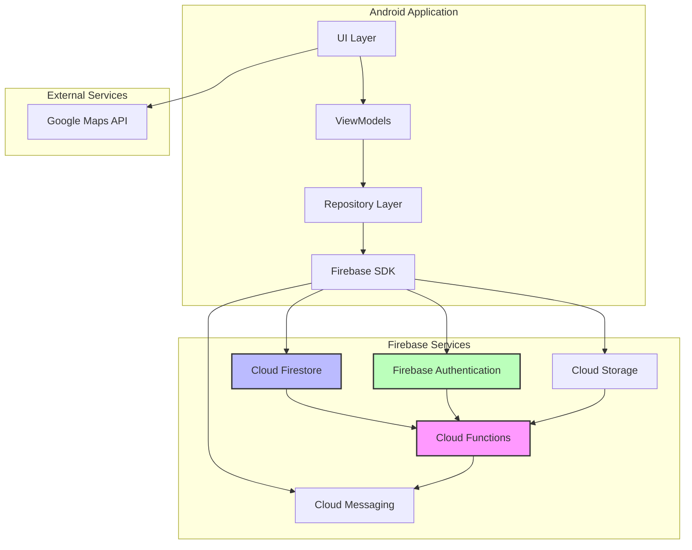
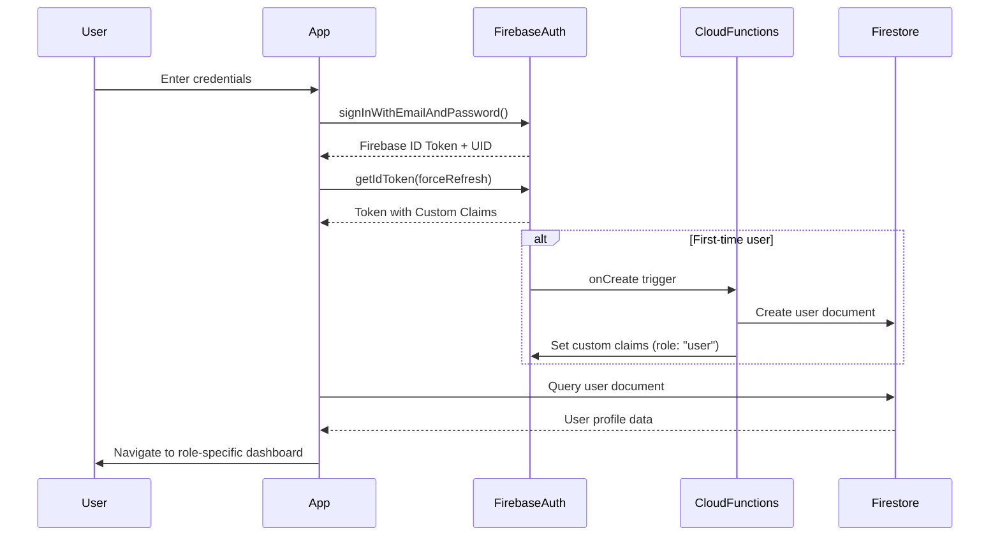
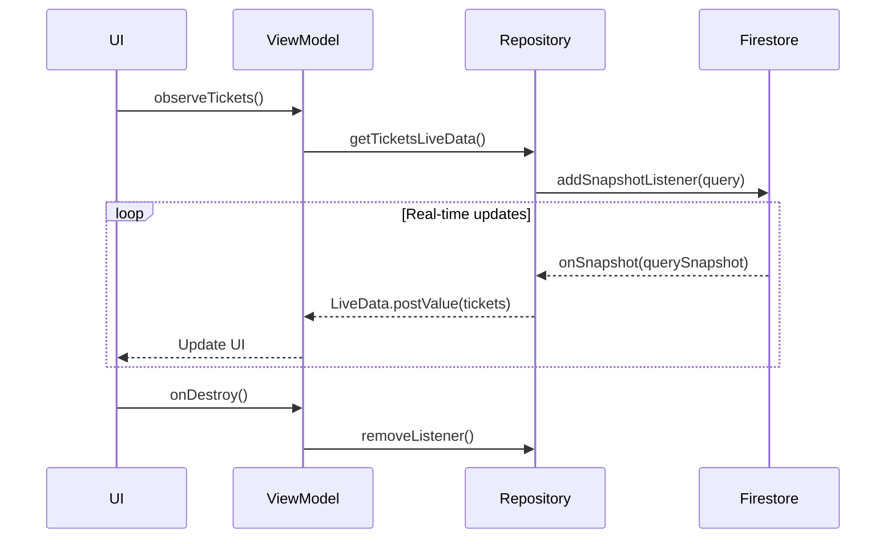
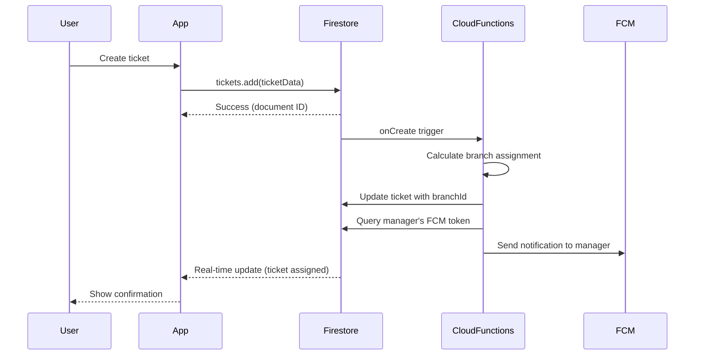

# Design Document: Laravel to Firebase Migration

## Overview

This design document specifies the technical architecture for migrating an Android service ticket management application from a Laravel + MySQL backend to a Firebase serverless architecture. The migration eliminates the need for dedicated server hosting while maintaining all existing functionality and adding real-time capabilities.

### Current Architecture

The existing system uses:
- Laravel REST API backend with MySQL database
- Retrofit HTTP client for API communication
- Laravel Sanctum for token-based authentication
- Traditional request-response pattern for data operations
- Server-side business logic in Laravel controllers
- Manual polling for data updates

### Target Architecture

The new Firebase-based system will use:
- Firebase Authentication for user management
- Cloud Firestore for NoSQL data storage
- Cloud Storage for image/file storage
- Cloud Functions for server-side business logic
- Firebase Cloud Messaging (FCM) for push notifications
- Real-time listeners for live data updates
- Direct client-to-Firebase communication (no intermediary API layer)

### Key Benefits

1. **Serverless Infrastructure**: Eliminates server maintenance, scaling, and hosting costs
2. **Real-Time Updates**: Built-in support for live data synchronization
3. **Offline Support**: Automatic local caching and sync when connectivity returns
4. **Scalability**: Automatic scaling based on demand
5. **Security**: Database-level security rules enforced by Firebase
6. **Cost Efficiency**: Pay-per-use pricing model
7. **Reduced Complexity**: Eliminates need for REST API layer

### Migration Scope

The migration covers four user roles (Admin, Manager, Employee, User) with the following features:
- User authentication (email/password, Google Sign-In, phone)
- Service ticket creation and management
- Photo attachments for tickets
- Branch-based routing and assignment
- Employee scheduling
- Payment processing
- Dashboard statistics
- Push notifications
- Role-based access control


## Architecture

### High-Level System Architecture



### Component Architecture

#### 1. Authentication Layer

**Firebase Authentication** replaces Laravel Sanctum:
- Manages user identity and session tokens
- Supports multiple authentication providers (email/password, Google, phone)
- Generates Firebase ID tokens for authenticated requests
- Stores custom claims for role-based access control

**Custom Claims Structure**:
```json
{
  "role": "manager",
  "branchId": "branch_123"
}
```

#### 2. Data Layer

**Cloud Firestore** replaces MySQL:
- NoSQL document database with collections and subcollections
- Real-time synchronization capabilities
- Offline persistence with automatic sync
- Compound indexes for complex queries
- Security Rules for access control

**Cloud Storage** for media files:
- Stores ticket photos and profile images
- Organized by ticket ID and user ID
- Storage Rules for access control
- Automatic CDN distribution

#### 3. Business Logic Layer

**Cloud Functions** replace Laravel controllers:
- Serverless functions triggered by HTTP requests or Firestore events
- Handle complex business logic (branch routing, dashboard aggregation)
- Send push notifications via FCM Admin SDK
- Enforce data validation and consistency
- Execute background tasks (photo cleanup, data aggregation)

**Function Types**:
- **Callable Functions**: Invoked directly from Android app (branch routing, user management)
- **HTTP Functions**: RESTful endpoints for external integrations
- **Firestore Triggers**: Respond to database changes (send notifications on status change)
- **Scheduled Functions**: Periodic tasks (cleanup, aggregation)

#### 4. Client Architecture

**Android App Structure**:
```
UI Layer (Activities/Fragments)
    ↓
ViewModel Layer (LiveData/StateFlow)
    ↓
Repository Layer (Data abstraction)
    ↓
Firebase SDK (Direct Firebase access)
```

**Key Changes from Retrofit**:
- Remove ApiClient, ApiService, and all request/response models
- Replace Retrofit Call objects with Firebase SDK methods
- Use Firestore listeners instead of polling
- Handle real-time updates via snapshot listeners
- Implement offline-first data access patterns


### Authentication Flow



### Data Flow Patterns

#### Real-Time Listener Pattern



#### Write Operation Pattern




## Components and Interfaces

### 1. Firebase Authentication Module

**Purpose**: Manage user authentication and session management

**Key Methods**:
```java
// FirebaseAuthManager.java
public class FirebaseAuthManager {
    private FirebaseAuth auth;
    
    // Email/Password authentication
    public Task<AuthResult> signInWithEmail(String email, String password);
    public Task<AuthResult> createUserWithEmail(String email, String password);
    public Task<Void> sendPasswordResetEmail(String email);
    
    // Google Sign-In
    public Task<AuthResult> signInWithGoogle(GoogleSignInAccount account);
    
    // Phone authentication
    public void verifyPhoneNumber(String phoneNumber, PhoneAuthProvider.OnVerificationStateChangedCallbacks callbacks);
    public Task<AuthResult> signInWithPhoneCredential(PhoneAuthCredential credential);
    
    // Session management
    public FirebaseUser getCurrentUser();
    public Task<GetTokenResult> getIdToken(boolean forceRefresh);
    public void signOut();
    
    // Custom claims
    public Task<Map<String, Object>> getCustomClaims();
    public String getUserRole();
    public String getUserBranchId();
}
```

**Integration Points**:
- Replaces Laravel Sanctum token management
- Removes dependency on ApiClient authentication headers
- Integrates with Cloud Functions for custom claims management

### 2. Firestore Repository Layer

**Purpose**: Abstract Firestore operations and provide clean API to ViewModels

**Key Repositories**:

```java
// TicketRepository.java
public class TicketRepository {
    private FirebaseFirestore db;
    private CollectionReference ticketsRef;
    
    // CRUD operations
    public Task<DocumentReference> createTicket(Ticket ticket);
    public Task<DocumentSnapshot> getTicket(String ticketId);
    public Task<Void> updateTicket(String ticketId, Map<String, Object> updates);
    public Task<Void> deleteTicket(String ticketId);
    
    // Real-time queries
    public LiveData<List<Ticket>> getUserTickets(String userId);
    public LiveData<List<Ticket>> getEmployeeTickets(String employeeId);
    public LiveData<List<Ticket>> getBranchTickets(String branchId);
    
    // Filtered queries
    public LiveData<List<Ticket>> getTicketsByStatus(String status, String userId);
    public LiveData<List<Ticket>> getTicketsByDateRange(Date start, Date end, String userId);
    
    // Pagination
    public Task<QuerySnapshot> getTicketsPage(DocumentSnapshot lastVisible, int pageSize);
}
```

```java
// UserRepository.java
public class UserRepository {
    private FirebaseFirestore db;
    private CollectionReference usersRef;
    
    public Task<Void> createUserDocument(String uid, User user);
    public Task<DocumentSnapshot> getUserDocument(String uid);
    public Task<Void> updateUserProfile(String uid, Map<String, Object> updates);
    public Task<Void> updateFCMToken(String uid, String token);
    public LiveData<User> getUserLiveData(String uid);
}
```

```java
// BranchRepository.java
public class BranchRepository {
    private FirebaseFirestore db;
    private CollectionReference branchesRef;
    
    public Task<QuerySnapshot> getAllBranches();
    public Task<DocumentSnapshot> getBranch(String branchId);
    public LiveData<List<Branch>> getBranchesLiveData();
    
    // Employee management
    public Task<DocumentReference> addEmployeeToBranch(String branchId, Employee employee);
    public Task<QuerySnapshot> getBranchEmployees(String branchId);
    public Task<Void> removeEmployeeFromBranch(String branchId, String employeeId);
}
```

```java
// PaymentRepository.java
public class PaymentRepository {
    private FirebaseFirestore db;
    
    public Task<DocumentReference> createPayment(String ticketId, Payment payment);
    public Task<Void> confirmPayment(String ticketId, String paymentId);
    public Task<QuerySnapshot> getTicketPayments(String ticketId);
    public LiveData<List<Payment>> getUserPaymentHistory(String userId);
}
```

### 3. Cloud Storage Manager

**Purpose**: Handle photo uploads and downloads

```java
// StorageManager.java
public class StorageManager {
    private FirebaseStorage storage;
    private StorageReference storageRef;
    
    // Upload operations
    public Task<UploadTask.TaskSnapshot> uploadTicketPhoto(String ticketId, Uri photoUri, OnProgressListener listener);
    public Task<UploadTask.TaskSnapshot> uploadProfilePhoto(String userId, Uri photoUri);
    
    // Download operations
    public Task<Uri> getTicketPhotoUrl(String ticketId, String filename);
    public Task<Uri> getProfilePhotoUrl(String userId);
    
    // Delete operations
    public Task<Void> deleteTicketPhotos(String ticketId);
    public Task<Void> deleteProfilePhoto(String userId);
    
    // Image compression
    public Bitmap compressImage(Bitmap original, int maxWidth, int maxHeight, int quality);
    
    // Progress tracking
    public interface OnProgressListener {
        void onProgress(double progress);
        void onComplete(Uri downloadUrl);
        void onError(Exception e);
    }
}
```

### 4. Cloud Functions Interface

**Purpose**: Define callable functions for business logic

**Callable Functions** (invoked from Android):

```javascript
// functions/index.js

// Branch routing algorithm
exports.assignTicketToBranch = functions.https.onCall(async (data, context) => {
  // Input: { ticketId, latitude, longitude }
  // Output: { branchId, distance }
  // Calculates nearest branch using Haversine formula
});

// Dashboard statistics
exports.getDashboardStats = functions.https.onCall(async (data, context) => {
  // Input: { role, branchId? }
  // Output: { totalTickets, completedTickets, revenue, avgCompletionTime }
  // Aggregates data based on user role
});

// User management (admin only)
exports.createUserAccount = functions.https.onCall(async (data, context) => {
  // Input: { email, role, branchId? }
  // Output: { uid, success }
  // Creates user in Auth and Firestore, sets custom claims
});

exports.setUserRole = functions.https.onCall(async (data, context) => {
  // Input: { uid, role, branchId? }
  // Output: { success }
  // Updates custom claims and Firestore document
});

exports.deleteUserAccount = functions.https.onCall(async (data, context) => {
  // Input: { uid }
  // Output: { success }
  // Removes user from Auth and Firestore
});
```

**Firestore Triggers** (automatic execution):

```javascript
// Send notification when ticket status changes
exports.onTicketStatusChange = functions.firestore
  .document('tickets/{ticketId}')
  .onUpdate(async (change, context) => {
    const before = change.before.data();
    const after = change.after.data();
    
    if (before.status !== after.status) {
      // Send FCM notification to ticket owner
    }
  });

// Create user document on new account
exports.onUserCreate = functions.auth.user().onCreate(async (user) => {
  // Create Firestore user document with default role
  // Set custom claims
});

// Cleanup photos when ticket is deleted
exports.onTicketDelete = functions.firestore
  .document('tickets/{ticketId}')
  .onDelete(async (snap, context) => {
    // Delete associated photos from Cloud Storage
  });
```

### 5. FCM Notification Manager

**Purpose**: Handle push notification registration and display

```java
// FCMManager.java
public class FCMManager {
    private FirebaseMessaging messaging;
    
    // Token management
    public Task<String> getToken();
    public void registerToken(String uid, String token);
    
    // Notification handling
    public void handleNotification(RemoteMessage message);
    public void showNotification(String title, String body, String ticketId);
    
    // Topic subscription
    public Task<Void> subscribeToTopic(String topic);
    public Task<Void> unsubscribeFromTopic(String topic);
}
```

**Android Service**:
```java
// MyFirebaseMessagingService.java
public class MyFirebaseMessagingService extends FirebaseMessagingService {
    @Override
    public void onMessageReceived(RemoteMessage message) {
        // Handle notification payload
        // Navigate to ticket detail if notification tapped
    }
    
    @Override
    public void onNewToken(String token) {
        // Update token in Firestore user document
    }
}
```


## Data Models

### Firestore Database Structure

```
firestore
├── users (collection)
│   └── {userId} (document)
│       ├── email: string
│       ├── name: string
│       ├── phone: string
│       ├── role: string (admin|manager|employee|user)
│       ├── branchId: string (for manager/employee)
│       ├── fcmTokens: array<string>
│       ├── profilePhotoUrl: string
│       ├── createdAt: timestamp
│       └── updatedAt: timestamp
│
├── tickets (collection)
│   └── {ticketId} (document)
│       ├── customerId: string (reference to user)
│       ├── customerName: string (denormalized)
│       ├── customerEmail: string (denormalized)
│       ├── customerPhone: string (denormalized)
│       ├── serviceType: string
│       ├── description: string
│       ├── status: string (pending|assigned|in_progress|completed|cancelled)
│       ├── priority: string (low|medium|high)
│       ├── location: geopoint
│       ├── address: string
│       ├── branchId: string (reference to branch)
│       ├── branchName: string (denormalized)
│       ├── assignedEmployeeId: string (reference to user)
│       ├── assignedEmployeeName: string (denormalized)
│       ├── scheduledDate: timestamp
│       ├── completedDate: timestamp
│       ├── photoUrls: array<string>
│       ├── estimatedCost: number
│       ├── finalCost: number
│       ├── createdAt: timestamp
│       ├── updatedAt: timestamp
│       │
│       └── payments (subcollection)
│           └── {paymentId} (document)
│               ├── amount: number
│               ├── method: string (cash|credit_card|digital_wallet)
│               ├── status: string (pending|paid|failed|refunded)
│               ├── transactionId: string
│               ├── employeeId: string (who completed work)
│               ├── paidAt: timestamp
│               └── createdAt: timestamp
│
├── branches (collection)
│   └── {branchId} (document)
│       ├── name: string
│       ├── location: geopoint
│       ├── address: string
│       ├── coverageRadius: number (in kilometers)
│       ├── managerId: string (reference to user)
│       ├── managerName: string (denormalized)
│       ├── phone: string
│       ├── email: string
│       ├── isActive: boolean
│       ├── createdAt: timestamp
│       ├── updatedAt: timestamp
│       │
│       └── employees (subcollection)
│           └── {employeeId} (document)
│               ├── userId: string (reference to user)
│               ├── name: string (denormalized)
│               ├── email: string (denormalized)
│               ├── phone: string (denormalized)
│               ├── specializations: array<string>
│               ├── isAvailable: boolean
│               ├── currentTicketCount: number
│               ├── totalCompletedTickets: number
│               ├── rating: number
│               ├── joinedAt: timestamp
│               └── updatedAt: timestamp
│
└── notifications (collection)
    └── {notificationId} (document)
        ├── userId: string (recipient)
        ├── type: string (ticket_created|status_changed|payment_received)
        ├── title: string
        ├── body: string
        ├── ticketId: string (optional reference)
        ├── isRead: boolean
        ├── createdAt: timestamp
        └── expiresAt: timestamp
```

### Data Model Classes

```java
// User.java
public class User {
    private String uid;
    private String email;
    private String name;
    private String phone;
    private String role;
    private String branchId;
    private List<String> fcmTokens;
    private String profilePhotoUrl;
    private Timestamp createdAt;
    private Timestamp updatedAt;
    
    // Constructors, getters, setters
    
    @Exclude
    public Map<String, Object> toMap() {
        // Convert to Map for Firestore
    }
    
    public static User fromSnapshot(DocumentSnapshot snapshot) {
        // Convert from Firestore snapshot
    }
}
```

```java
// Ticket.java
public class Ticket {
    private String id;
    private String customerId;
    private String customerName;
    private String customerEmail;
    private String customerPhone;
    private String serviceType;
    private String description;
    private String status;
    private String priority;
    private GeoPoint location;
    private String address;
    private String branchId;
    private String branchName;
    private String assignedEmployeeId;
    private String assignedEmployeeName;
    private Timestamp scheduledDate;
    private Timestamp completedDate;
    private List<String> photoUrls;
    private double estimatedCost;
    private double finalCost;
    private Timestamp createdAt;
    private Timestamp updatedAt;
    
    // Constructors, getters, setters
    
    @Exclude
    public Map<String, Object> toMap() {
        // Convert to Map for Firestore
    }
    
    public static Ticket fromSnapshot(DocumentSnapshot snapshot) {
        // Convert from Firestore snapshot
    }
}
```

```java
// Branch.java
public class Branch {
    private String id;
    private String name;
    private GeoPoint location;
    private String address;
    private double coverageRadius;
    private String managerId;
    private String managerName;
    private String phone;
    private String email;
    private boolean isActive;
    private Timestamp createdAt;
    private Timestamp updatedAt;
    
    // Constructors, getters, setters
    
    @Exclude
    public Map<String, Object> toMap() {
        // Convert to Map for Firestore
    }
    
    public static Branch fromSnapshot(DocumentSnapshot snapshot) {
        // Convert from Firestore snapshot
    }
}
```

```java
// Payment.java
public class Payment {
    private String id;
    private double amount;
    private String method;
    private String status;
    private String transactionId;
    private String employeeId;
    private Timestamp paidAt;
    private Timestamp createdAt;
    
    // Constructors, getters, setters
    
    @Exclude
    public Map<String, Object> toMap() {
        // Convert to Map for Firestore
    }
    
    public static Payment fromSnapshot(DocumentSnapshot snapshot) {
        // Convert from Firestore snapshot
    }
}
```

### Denormalization Strategy

**Why Denormalize?**
- Firestore doesn't support SQL-style joins
- Reduces number of reads (cost optimization)
- Improves query performance
- Enables efficient list displays

**Denormalized Fields**:
1. **Tickets**: Store customer name/email/phone (avoid extra user lookup)
2. **Tickets**: Store branch name (display in lists without branch lookup)
3. **Tickets**: Store assigned employee name (display in lists)
4. **Branches**: Store manager name (display in lists)
5. **Branch Employees**: Store user details (avoid user lookup)

**Consistency Maintenance**:
- Use Cloud Functions triggers to update denormalized data
- Example: When user name changes, update all tickets where customerId matches

```javascript
// Cloud Function to maintain consistency
exports.onUserNameChange = functions.firestore
  .document('users/{userId}')
  .onUpdate(async (change, context) => {
    const before = change.before.data();
    const after = change.after.data();
    
    if (before.name !== after.name) {
      const userId = context.params.userId;
      const newName = after.name;
      
      // Update all tickets where this user is the customer
      const ticketsQuery = db.collection('tickets')
        .where('customerId', '==', userId);
      const tickets = await ticketsQuery.get();
      
      const batch = db.batch();
      tickets.forEach(doc => {
        batch.update(doc.ref, { customerName: newName });
      });
      await batch.commit();
    }
  });
```

### Required Firestore Indexes

**Compound Indexes** (must be created in Firebase Console or via firebase.json):

```json
{
  "indexes": [
    {
      "collectionGroup": "tickets",
      "queryScope": "COLLECTION",
      "fields": [
        { "fieldPath": "customerId", "order": "ASCENDING" },
        { "fieldPath": "status", "order": "ASCENDING" },
        { "fieldPath": "createdAt", "order": "DESCENDING" }
      ]
    },
    {
      "collectionGroup": "tickets",
      "queryScope": "COLLECTION",
      "fields": [
        { "fieldPath": "branchId", "order": "ASCENDING" },
        { "fieldPath": "status", "order": "ASCENDING" },
        { "fieldPath": "createdAt", "order": "DESCENDING" }
      ]
    },
    {
      "collectionGroup": "tickets",
      "queryScope": "COLLECTION",
      "fields": [
        { "fieldPath": "assignedEmployeeId", "order": "ASCENDING" },
        { "fieldPath": "status", "order": "ASCENDING" },
        { "fieldPath": "scheduledDate", "order": "ASCENDING" }
      ]
    },
    {
      "collectionGroup": "tickets",
      "queryScope": "COLLECTION",
      "fields": [
        { "fieldPath": "assignedEmployeeId", "order": "ASCENDING" },
        { "fieldPath": "scheduledDate", "order": "ASCENDING" }
      ]
    }
  ]
}
```


### Security Rules Design

**Firestore Security Rules** (firestore.rules):

```javascript
rules_version = '2';
service cloud.firestore {
  match /databases/{database}/documents {
    
    // Helper functions
    function isAuthenticated() {
      return request.auth != null;
    }
    
    function getUserRole() {
      return request.auth.token.role;
    }
    
    function getUserBranchId() {
      return request.auth.token.branchId;
    }
    
    function isAdmin() {
      return isAuthenticated() && getUserRole() == 'admin';
    }
    
    function isManager() {
      return isAuthenticated() && getUserRole() == 'manager';
    }
    
    function isEmployee() {
      return isAuthenticated() && getUserRole() == 'employee';
    }
    
    function isUser() {
      return isAuthenticated() && getUserRole() == 'user';
    }
    
    function isOwner(userId) {
      return isAuthenticated() && request.auth.uid == userId;
    }
    
    // Users collection
    match /users/{userId} {
      // Users can read and update their own document
      allow read: if isOwner(userId) || isAdmin();
      allow create: if isAuthenticated();
      allow update: if isOwner(userId) && 
                      !request.resource.data.diff(resource.data).affectedKeys().hasAny(['role', 'branchId']);
      allow delete: if isAdmin();
    }
    
    // Tickets collection
    match /tickets/{ticketId} {
      // Read rules
      allow read: if isAdmin() ||
                    (isManager() && resource.data.branchId == getUserBranchId()) ||
                    (isEmployee() && resource.data.assignedEmployeeId == request.auth.uid) ||
                    (isUser() && resource.data.customerId == request.auth.uid);
      
      // Create rules
      allow create: if isAuthenticated() && 
                      request.resource.data.customerId == request.auth.uid &&
                      request.resource.data.status == 'pending';
      
      // Update rules
      allow update: if isAdmin() ||
                      (isManager() && resource.data.branchId == getUserBranchId()) ||
                      (isEmployee() && resource.data.assignedEmployeeId == request.auth.uid &&
                       validStatusTransition(resource.data.status, request.resource.data.status));
      
      // Delete rules
      allow delete: if isAdmin() || 
                      (isUser() && resource.data.customerId == request.auth.uid && 
                       resource.data.status == 'pending');
      
      // Validate status transitions
      function validStatusTransition(oldStatus, newStatus) {
        return (oldStatus == 'assigned' && newStatus == 'in_progress') ||
               (oldStatus == 'in_progress' && newStatus == 'completed') ||
               (oldStatus == 'in_progress' && newStatus == 'cancelled');
      }
      
      // Payments subcollection
      match /payments/{paymentId} {
        allow read: if isAdmin() ||
                      (isManager() && get(/databases/$(database)/documents/tickets/$(ticketId)).data.branchId == getUserBranchId()) ||
                      (isEmployee() && get(/databases/$(database)/documents/tickets/$(ticketId)).data.assignedEmployeeId == request.auth.uid) ||
                      (isUser() && get(/databases/$(database)/documents/tickets/$(ticketId)).data.customerId == request.auth.uid);
        
        allow create: if isEmployee() || isManager() || isAdmin();
        
        allow update: if (isUser() && get(/databases/$(database)/documents/tickets/$(ticketId)).data.customerId == request.auth.uid &&
                         resource.data.status == 'pending' && request.resource.data.status == 'paid') ||
                        isAdmin();
      }
    }
    
    // Branches collection
    match /branches/{branchId} {
      // All authenticated users can read branches
      allow read: if isAuthenticated();
      
      // Only admins can create, update, delete branches
      allow create, update, delete: if isAdmin();
      
      // Employees subcollection
      match /employees/{employeeId} {
        allow read: if isAuthenticated();
        allow create, update, delete: if isAdmin() || 
                                        (isManager() && getUserBranchId() == branchId);
      }
    }
    
    // Notifications collection
    match /notifications/{notificationId} {
      allow read: if isAuthenticated() && resource.data.userId == request.auth.uid;
      allow update: if isAuthenticated() && resource.data.userId == request.auth.uid;
      allow create: if false; // Only Cloud Functions can create notifications
      allow delete: if isAuthenticated() && resource.data.userId == request.auth.uid;
    }
  }
}
```

**Cloud Storage Security Rules** (storage.rules):

```javascript
rules_version = '2';
service firebase.storage {
  match /b/{bucket}/o {
    
    // Helper functions
    function isAuthenticated() {
      return request.auth != null;
    }
    
    function isAdmin() {
      return request.auth.token.role == 'admin';
    }
    
    function isValidImage() {
      return request.resource.size < 10 * 1024 * 1024 && // 10MB max
             request.resource.contentType.matches('image/.*');
    }
    
    // Ticket images
    match /ticket-images/{ticketId}/{filename} {
      // Allow read if user has access to the ticket (checked via Firestore)
      allow read: if isAuthenticated();
      
      // Allow upload if user is creating/updating their own ticket
      allow write: if isAuthenticated() && isValidImage();
      
      // Allow delete by admins or Cloud Functions
      allow delete: if isAdmin();
    }
    
    // Profile photos
    match /profile-photos/{userId}/{filename} {
      // Anyone can read profile photos
      allow read: if true;
      
      // Users can upload their own profile photo
      allow write: if isAuthenticated() && 
                     request.auth.uid == userId && 
                     isValidImage();
      
      // Users can delete their own profile photo
      allow delete: if isAuthenticated() && request.auth.uid == userId;
    }
  }
}
```

